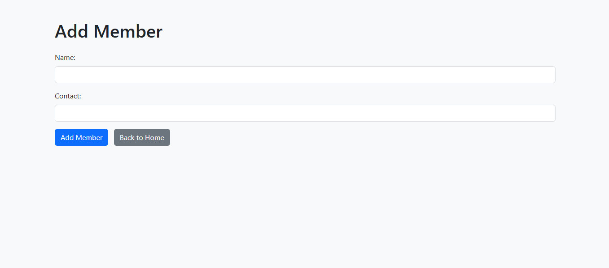

# Library Management System

A simple **Library Management System** built using **Python**, **Data Structures & Algorithms (DSA)**, **SQLite**, and **Flask** —  
with both a **terminal version** and a **web version**

## Features

- Add new books
- View all books
- Search books by title
- Delete books
- Add library members
- View all members
- Issue books to members
- Return books
- View all currently issued books
- View complete issue & return history

## Technologies Used

- **Python**
- **Data Structures & Algorithms (DSA)**
- **SQLite**
- **Flask** (for the web version)
- **Bootstrap** (for responsive, clean UI)

## Screenshots

### Home Page

### Add Book

### View Books

### Search Book

### Delete Book

### Add Member

### View Members

### Issue Book

### Return Book

### Currently Issued Book

### View Issued Books & History

